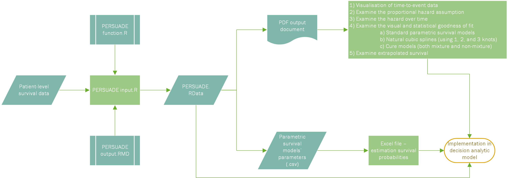

# PERSUADE  
**ParamEtRic SUrvivAl moDel sElection**

A standardized R tool to support the selection, comparison, and communication of parametric survival models, and their implementation in decision-analytic models.

---

## Overview

PERSUADE guides analysts through a reproducible workflow for survival analysis and model selection. It provides:

- Kaplan–Meier visualizations and diagnostics
- Assessment of proportional hazards (PH) assumption
- Observed and predicted hazard function plots
- Fit comparisons of standard, spline-based, and cure models
- Goodness-of-fit statistics (AIC/BIC)
- Explore model extrapolation beyond observed data
- Automated PDF reports for communication
- Export the parametric survival model parameters for use in decision-analytic models

The framework is designed for transparency and consistency when survival analysis feeds into decision-analytic models.

---

## Prerequisites 
- R (version compatible with survival and other dependencies)
- Recommended: RStudio for better environment handling
- Install PERSUADE package: `devtools::install_github("Bram-R/PERSUADE", quiet = TRUE)`
- Load PERSUADE package: `library(PERSUADE)`

## Quick start

The easiest way to get started is by running the included example workflow script: `PERSUADE_example_workflow.R` 

This script:

- Loads example survival data.
- Runs the main PERSUADE analysis (`f_PERSUADE()`).
- Summarizes results with `print()`, `summary()`, and `plot()`.
- Generates a ready-to-share PDF report via `f_generate_report()`.
- Exports fitted model parameters to .csv.

---

## Step-by-step workflow

### 1. Install and load PERSUADE package
```r
devtools::install_github("Bram-R/PERSUADE", quiet = TRUE)
library(PERSUADE)
```

### 2. Run example analysis
```r
PERSUADE <- f_PERSUADE(
  name = "BC_OS",
  years = flexsurv::bc$recyrs,   # time-to-event
  status = flexsurv::bc$censrec, # event indicator
  group = flexsurv::bc$group,    # grouping variable
  strata = TRUE,
  spline_mod = TRUE,
  cure_mod = TRUE,
  time_unit = 1/12,              # months in years
  time_horizon = 40,
  time_pred_surv_table = c(0,1,2,5,10,20,30,40)
)
```

### 3. Inspect the object
```r
print(PERSUADE)
```
Shows a high-level overview of the analysis: groups and number of objects/individuals.

### 4. Summarize results
```r
# Kaplan–Meier estimates
summary(PERSUADE, type = "km")

# Survival probabilities at time points
summary(PERSUADE, type = "surv_probs")

# Goodness-of-fit for standard parametric models
summary(PERSUADE, type = "gof")

# Goodness-of-fit for spline-based models
summary(PERSUADE, type = "gof_spline")

# Goodness-of-fit for cure models
summary(PERSUADE, type = "gof_cure")
```
Shows different summaries related to the Kaplan-Meier analyses, survival probabilities over time and goodness of fit statistics.

### 5. Visualize results
```r
# Kaplan–Meier curves
plot(PERSUADE, type = "km")

# Proportional hazards diagnostics
plot(PERSUADE, type = "ph")

# Observed smoothed hazard
plot(PERSUADE, type = "hr")

# Standard parametric models
plot(PERSUADE, type = "param_models")

# Spline-based models
plot(PERSUADE, type = "spline_models")

# Cure models
plot(PERSUADE, type = "cure_models")
```
Shows different visualisations of the time-to-event data as well as parametric survival models.

### 6. Generate the report
```r
f_generate_report(PERSUADE)
```
This compiles all results into a PDF report (e.g. BC_OS.pdf) containing diagnostics, model fits, and extrapolations, an output folder named after your project (BC_OS_output/) with a subfolder /Images/ including all plots

### 7. Export model parameters
```r
# Copy to clipboard (for copying in PERSUADE Excel template.xltx)
write.table(PERSUADE$surv_model_excel, "clipboard-128", sep = "\t", col.names = FALSE)

# Export to CSV
write.csv(PERSUADE$surv_model_excel, "BC_OS_output/PERSUADE_models_comma.csv")
write.csv2(PERSUADE$surv_model_excel, "BC_OS_output/PERSUADE_models_semicolon.csv")
```
This exports the parametric survival model parameters.

---

## Workflow diagram

Visualize the process via the included diagram:  

  

*(Alternatively, open the `.vsdx` version if preferred.)*

---

### Tips for running your own analyses

Start by running the example script to familiarize yourself with the workflow. For your own data: 

- copy `PERSUADE_example_workflow.R` (see also vignette using: `browseVignettes("PERSUADE")`)
- replace the input section with your dataset 
- set the project name and outcome identifier using the `name` parameter  
- within the call to `f_PERSUADE(...)`, toggle options (`TRUE`/`FALSE`) for the analyses you want to run  

---


## Extending or customizing

- Add new model types: incorporate additional parametric distributions or non-parametric methods by extending `f_PERSUADE()`.  
- Refine plots: customize visualizations in `PERSUADE_output_functions.R` or adopt themes for publication-quality graphics.  
- Scale to new data formats: build data preprocessing modules for commonly used formats (e.g., survival objects, breakpoints, long-format datasets).  
- Automate Reporting: enhance the R Markdown template for production-ready reports with headers, metadata, or version control.  

---

## Acknowledgments & history

- Origins: this repository represents an ongoing effort to standardize survival model workflows in decision analysis.  
- Contributors: developed by **Bram-R** (https://orcid.org/0000-0001-5785-9228) and **Xa4P** (https://orcid.org/0000-0003-3563-0013); contributions are welcome via pull requests or issues.  

---

## License & contact

Licensed under **GPL3**.  
For questions, enhancements, or collaboration, reach out via GitHub Discussions or Issues.  

---


